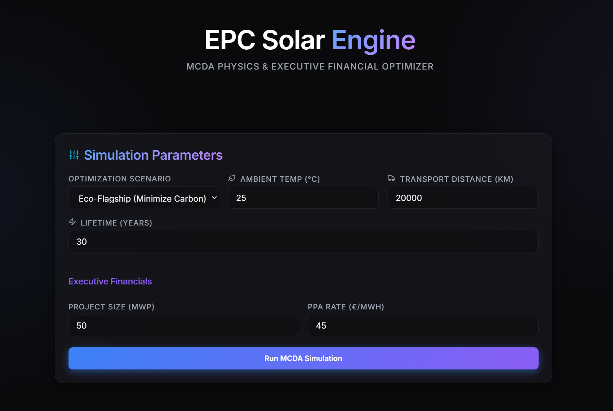

# EPC Solar Engine

Welcome to the official repository for the **EPC Solar Engine** — a next-generation PV Module Multi-Criteria Decision Analysis (MCDA) and Executive Financial Optimizer built as a standalone desktop library for utility-scale solar EPCs.

---

## 🛑 Intellectual Property Restriction Notice
**The full EPC Solar Engine source code, including its proprietary TOPSIS scoring algorithms, dynamic LCOE optimization logic, and Executive Financial layers, is strictly locked to protect intellectual property.** 

This repository serves as the public-facing hub and documentation for the project. To allow stakeholders to experience the speed and utility of the engine, a mathematically-limited **Alpha Demo** is available for download below.

---

## 🚀 Alpha Demo Available Now
We have released a sandboxed **Alpha Demo** for public testing and portfolio demonstration. The downloadable executable is a natively compiled Windows binary containing a restricted version of the physics engine.

### Demo Limitations
- **Module Ranking:** Locked to display only the Top 5 modules.
- **Optimization Scenario:** Hard-locked to the "Eco-Flagship (Minimize Carbon)" scenario.
- **Project Scope:** Maximum project size capped at 5 MWp.

📥 **[Download the Alpha Demo (Windows Executable) in the Releases Tab](https://github.com/Realsinister/solar-ai-engine/releases)**

---

## ⚙️ Under the Hood: Data & Architecture
While the proprietary math is hidden, the engine is built upon rigorous, real-world data science and modern software architecture.

### Real-World Datasets
- **SAM CEC Module Database:** Utilized for accurate baseline electrical parameters and temperature coefficients across the industry.
- **Logistical Carbon Benchmarks:** Integrated with real-world LCA (Life Cycle Assessment) and EPD metrics to calculate exact Scope 3 logistical carbon footprints.
- *(Note: Specific proprietary yield-modifiers and supply chain pricing data have been removed from the public alpha).*

### Tech Stack
- **FastAPI & Python:** The core physics engine is built on Python, utilizing FastAPI to handle asynchronous calculation requests.
- **Parquet / PyArrow Database:** Replaced legacy relational databases with predicate-pushdown Parquet data structures, enabling zero-latency querying and evaluation across 21,000+ PV modules.
- **Nuitka Compilation:** The entire Python backend and React frontend are natively compiled into a seamless, offline Windows `.exe` application—no terminal or Python installation required.
- **React & Vite Frontend:** A premium, glassmorphism UI built with TailwindCSS and Recharts for interactive Radar and Tornado analytics.

---

## 🔒 Full-Fledged Premium Features (Private)
The unrestricted premium version of the software is actively utilized for utility-scale project modeling. Its full capabilities include:
* **Dynamic Bifacial Albedo Physics:** Real-time calculation of rear-side energy gain based on ground reflectance factors, panel view angles, and bifaciality coefficients.
* **Unrestricted MCDA Modeling:** Full access to the TOPSIS mathematical matrix, allowing for cost-biased (LCOE) or efficiency-biased (Space Constrained) procurement ranking.
* **Financial Tornado Sensitivity:** Real-time manipulation of CAPEX/OPEX inputs to visualize IRR and NPV impacts instantly.
* **Automated Executive Pitch Generator:** Synthetic natural language generation of board-ready elevator pitches defending procurement choices based on Pareto dominance.

---

## 🔮 In Active Development & Upcoming Features
We are currently expanding the private engine's backend to include advanced capabilities:
* **AI PPA Price Forecasting:** Machine learning models trained on historical European energy markets to predict long-term Power Purchase Agreement rates.
* **Neural Yield Prediction:** Replacing static base irradiance models with dynamic neural network yield predictions that account for micro-climate shifts and extreme weather events.
* **User Profiles & Simulation History Database:** SQLite-backed repository allowing engineers to log past simulation results and perform side-by-side comparative analysis between historical runs.

## Developer Contact
For business inquiries, access to the full premium software, or to discuss the mathematical implementation of the MCDA and Life Cycle Assessment tracking, please contact the developer:

**Yash Gupta**
- [LinkedIn Profile](https://www.linkedin.com/in/yashjgupta/)
